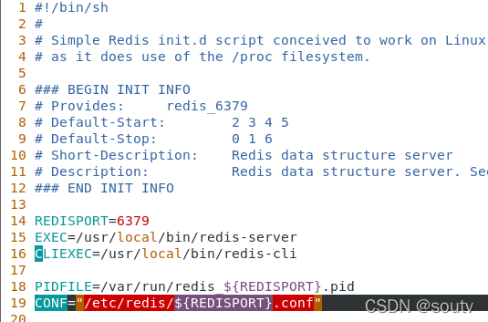

# Redis设置开机自启动

一，找到redis安装目录，我的是安装在opt目录下的。

二，在redis安装目录执行 cp redis-6.2.6/utils/redis_init_script /etc/init.d/redis 命令。

三，修改刚cp的文件，vim redis。修改第19行的配置，修改为自己手动启动redis时，使用的redis.conf文件的路径。然后保存。

四，将redis加入到开机自启动中，chkconfig --add redis 。查看是否将redis添加到开机自启动中，chkconfig --list。

五，检查一下redis.conf文件是否设置成了守护进程，没有的话设置为守护进程，然后保存退出。

 六，试下重启Linux，然后查看redis进程，可以看到redis进程随着开机自启动了。

————————————————

版权声明：本文为CSDN博主「soutv」的原创文章，遵循CC 4.0 BY-SA版权协议，转载请附上原文出处链接及本声明。

原文链接：https://blog.csdn.net/huchaun/article/details/122733897